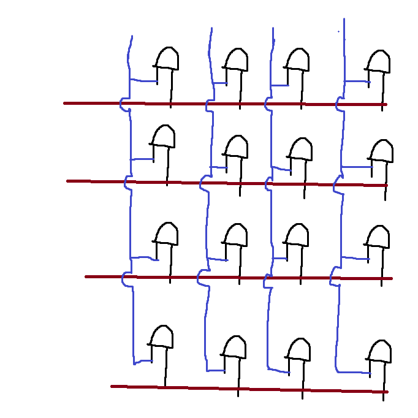
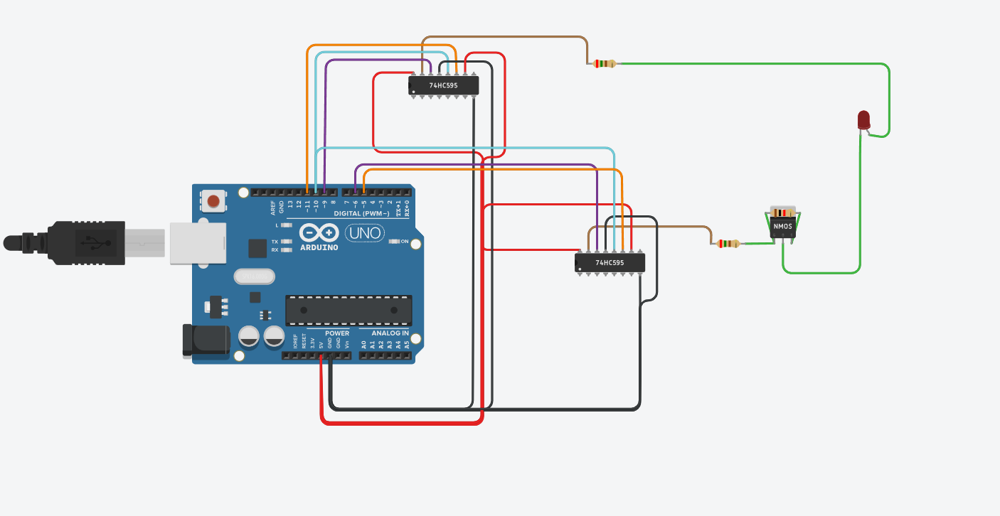

# Led_matrix_controller

an arduino project where we control a led matrix by multiplexing with shift registers

# how to make 
1. create your led matrix 

 

   
  
    
  

connect LED anodes and cathodes in rows and collums to form a matrix as shown in the above pictures 
By connecting +5V to a row and GND to a collumn we can turn on any single LED one at a time 
to have multiple LED's at a time we just need to set them on and off fast enough 

2. build the controller

 
 
  

To make this a little more scaleable we are going to use shift registers and controlling them with an arduino 
upload the .ino to your arduino (i used and arduino uno but a leonardo should probably work) 

 
 

this is the rough idea on how we connect the arduino to the shift registers 

if you do not know what a shift register is or how it works i recommend watching these 2 videos 

https://www.youtube.com/watch?v=6fVbJbNPrEU  
https://www.youtube.com/watch?v=Ys2fu4NINrA  
  
 
adding more LES's looks like this 

 
 

if you need more shift registers you can cascade them (see documentation for your shift registers) 

 

# how to use
needed python packages
pygame
pyserial
tkinter

## injector.py
injector allows you to draw stuff on a canvas, the canvas size can be easily changed from the code by modifying the collumns or rows on line 21 and 22 
pressing the "S" key on your keyboard sends the image to the arduino 
if the program crashes on startup you migth need to change line 24 to what ever usb port your arduino is attatched to 
if your image shows as reversed on your led matrix you need to comment out lines 49 and 52, and uncomment lines 48 and 51
this reverses the order of pieces on the grid 

 

## json mapmaker.py
allows you to make json files that animationinjector.py can read. 
draw something and press the "S" key on your keyboard. this saves matrixanimationmap.json on the diractory of this file. 
drawing another shape and pressing "S" again adds what ever you have drawn as the next frame of your animation. 
if your animation shows as reversed on your led matrix you need to comment out lines 49 and 52, and uncomment lines 48 and 51
 

## animationinjector.py
selects a json file and starts to send the data to the arduino 
if after you select a file you migth need to change the port on line 11 to what ever port your arduino is plugged in to 

 

